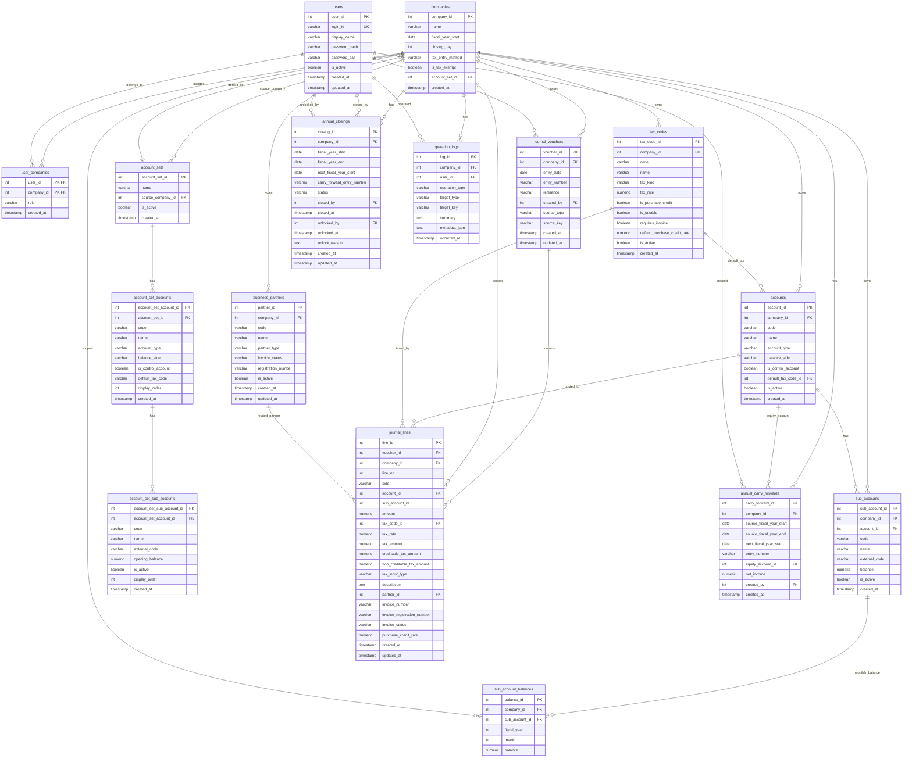

# AccountingApp ERD

このERDは [schema.sql](/D:/honlabo/SQLiteAcc/AccountingApp/Database/schema.sql:1) の現行定義を元に、AccountingApp が利用している SQLite スキーマを整理したものです。

## ER図

## 主なテーブル

- `companies`
  会社の基本設定。SQLite版ではトリガーにより `1 DB = 1 company` に制限されています。
- `users`, `user_companies`
  ユーザー本体と会社への所属。現状は1社前提でも、権限付与テーブルは残っています。
- `accounts`, `sub_accounts`, `tax_codes`, `business_partners`
  日常運用で使うマスタ群です。
- `account_sets`, `account_set_accounts`, `account_set_sub_accounts`
  勘定科目テンプレートを保持するテーブル群です。`companies.account_set_id` で採用中のテンプレートを参照できます。
- `journal_vouchers`, `journal_lines`
  仕訳ヘッダと明細。`journal_vouchers` が親、`journal_lines` が子です。
- `sub_account_balances`
  補助科目ごとの月次残高です。
- `annual_carry_forwards`, `annual_closings`
  年度締め・繰越関連の記録です。
- `operation_logs`
  主要操作の監査ログです。

## 主な制約

- `companies`
  `closing_day` は `1..31`、`tax_entry_method` は `gross | net`。
- `accounts`
  `UNIQUE(company_id, code)`。
  `account_type` は `asset | liability | equity | revenue | expense`。
  `balance_side` は `debit | credit`。
- `sub_accounts`
  `UNIQUE(company_id, account_id, code)`。
- `account_sets`
  `UNIQUE(name)`。
- `account_set_accounts`
  `UNIQUE(account_set_id, code)`。
- `account_set_sub_accounts`
  `UNIQUE(account_set_account_id, code)`。
- `tax_codes`
  `UNIQUE(company_id, code)`。
  `tax_kind` は `sales | purchase | non_taxable | exempt | out_of_scope`。
- `business_partners`
  `UNIQUE(company_id, code)`。
  `partner_type` は `customer | supplier | both | other`。
  `invoice_status` は `qualified | exempt | unregistered | unknown`。
- `journal_vouchers`
  `UNIQUE(company_id, entry_number)`。
  `source_type` は `manual | annual_carry_forward`。
- `journal_lines`
  `UNIQUE(voucher_id, line_no)`。
  `side` は `debit | credit`、`amount > 0`。
- `sub_account_balances`
  `UNIQUE(company_id, sub_account_id, fiscal_year, month)`。
- `annual_carry_forwards`
  `UNIQUE(company_id, next_fiscal_year_start)` と `UNIQUE(company_id, entry_number)`。
- `annual_closings`
  `UNIQUE(company_id, fiscal_year_start)` と `UNIQUE(company_id, next_fiscal_year_start)`。
  `status` は `open | closed`。

## インデックス

- `idx_user_companies_company`
- `idx_accounts_company`
- `idx_sub_accounts_company_account`
- `idx_account_sets_source_company`
- `idx_account_set_accounts_set`
- `idx_account_set_sub_accounts_parent`
- `idx_tax_codes_company`
- `idx_business_partners_company`
- `idx_journal_vouchers_company_date`
- `idx_journal_vouchers_company_number`
- `idx_journal_lines_voucher`
- `idx_journal_lines_company_account`
- `idx_journal_lines_company_partner`
- `idx_accounts_company_active`
- `idx_sub_account_balances_company_period`
- `idx_annual_carry_forwards_company_start`
- `idx_annual_closings_company_year`
- `idx_annual_closings_company_status`
- `idx_journal_vouchers_company_source`
- `idx_operation_logs_company_time`
- `idx_operation_logs_company_target`

## 補足

- `journal_lines.sub_account_id` は外部キー制約を持たず、補助科目なしを `0` で表現します。
- `journal_vouchers.source_type = 'annual_carry_forward'` は年度繰越仕訳を示します。
- `account_set_accounts.default_tax_code` は `tax_codes.tax_code_id` ではなく税区分コード文字列を保持します。
- `account_sets.source_company_id` はテンプレートのコピー元会社を示す任意参照です。
